# Lab4Web

| INDIRA ALINE         |    312010042       |
| -----------------    | -------------------|
| TI.20.A.1            |PEMROGRAMAN WEB     |
| PRAKTIKUM 4          | PERTEMUAN 5        |

Dipertemuan kali ini akan membahas bagaimana membuat **Website Layout** dengan property **float** dan juga membuat ***box element***

## 1). MEMBUAT DOKUMEN HTML DENGAN NAMA lab4_box.html

```html
<!DOCTYPE html>
<html lang="en">
<head>
    <meta charset="UTF-8">
    <meta http-equiv="X-UA-Compatible" content="IE=edge">
    <meta name="viewport" content="width=device-width, initial-scale=1.0">
    <title>Box Element</title>
</head>
<body>
    <header>
        <h1>Box Element</h1>
    </header>
</body>
</html>
```

## 2). MEMBUAT BOX ELEMENT
## Code & Output
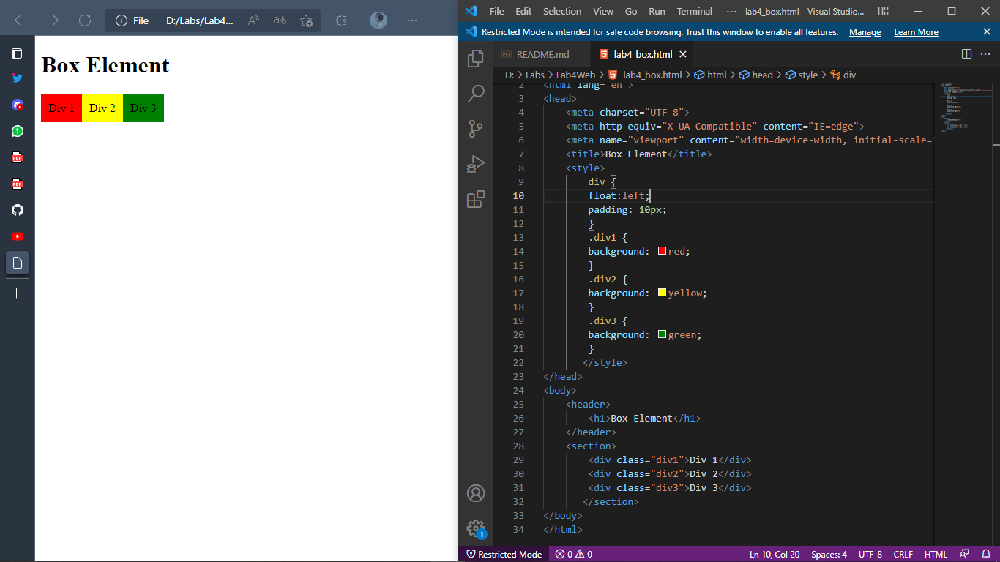
Disana sudah terdapat section dengan tag div yang kemudian diberi Deklarsi **CSS INTERNAL** dan ***property Float***

***code html***
```html
<section>
        <div class="div1">Div 1</div>
        <div class="div2">Div 2</div>
        <div class="div3">Div 3</div>
    </section>
```

***code css***
```css
    <style>
        div{
            float: left;
            padding: 10px;
        }
        .div1{
            background: red;
        }
        .div2{
            background: yellow;
        }
        .div3{
            background: green;
        }
    </style>
```

## 3). MENGATUR CLEARFIX ELEMENT
## Code & Output
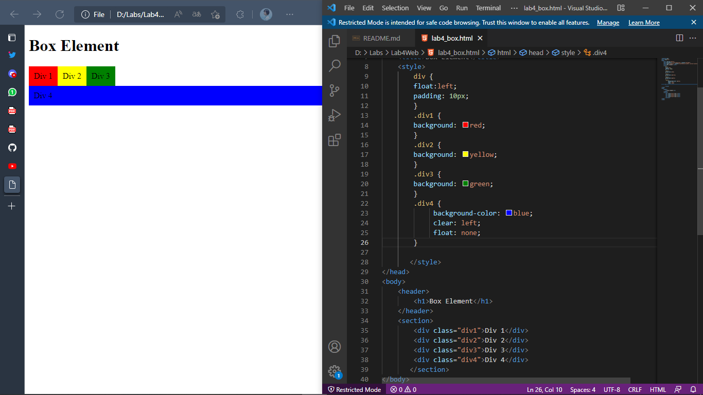
Ditambahkan tag **div4** kembali dan kemudian dibuat dan dideklarasikan di ***css internal*** dengan ***property clear: right*** dan juga ***float:none*** saya melakukan eksperimen dengan menjadikan nya **right** dan gambar diatas adalah contoh nya.

**code html**
```html
        <div class="div4">Div 4</div>
```

**code css**
```css
.div4{
            background-color: blue;
            clear: right;
            float: none;
     }
```
-----------------------------------------------------------------------------
### MEMBUAT FOLDER BARU DENGAN NAMA lab4_layout, KEMUDIAN BUATLAH FILE BARU DI DALAM NYA DENGAN NAMA **home.html** DAN FILE CSS NYA DENGAN NAMA **style.css**

## 4).BUAT KERANGKA LAYOUT DENGAN SEMANTIC ELEMENT
## Code & Output
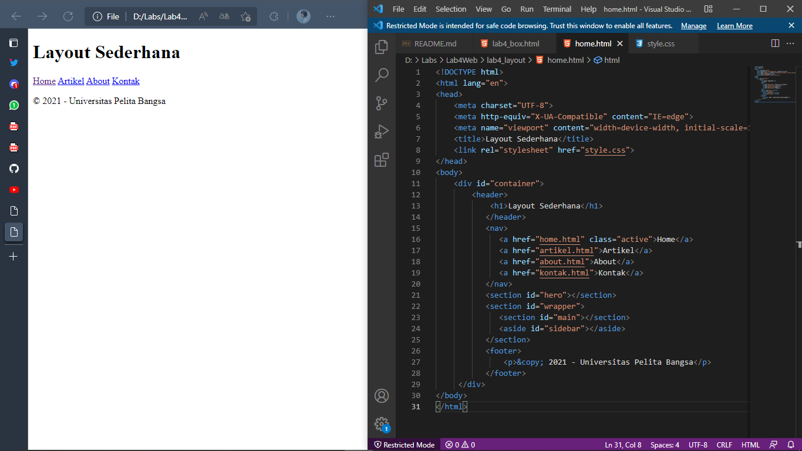
Ini adalah web layout dengan menggunakan **semantic element** seperti **header** **footer** dll

**code html**
```html
<!DOCTYPE html>
<html lang="en">
<head>
    <meta charset="UTF-8">
    <meta http-equiv="X-UA-Compatible" content="IE=edge">
    <meta name="viewport" content="width=device-width, initial-scale=1.0">
    <title>Layout Sederhana</title>
    <link rel="stylesheet" href="style.css">
</head>
<body>
    <div id="container">
        <header>
            <h1>Layout Sederhana</h1>
        </header>
        <nav>
            <a href="home.html" class="active">Home</a>
            <a href="artikel.html">Artikel</a>
            <a href="about.html">About</a>
            <a href="kontak.html">Kontak</a>
        </nav>
        <section id="hero"></section>
        <section id="wrapper">
            <section id="main"></section>
            <aside id="sidebar"></aside>
        </section>
        <footer>
            <p>© 2022 - Universitas Pelita Bangsa</p>
        </footer>
    </div>
</body>
</html>
```

## 5). MENAMBAHKAN FILE CSS UNTUK MEMBUAT LAYOUT
## Output
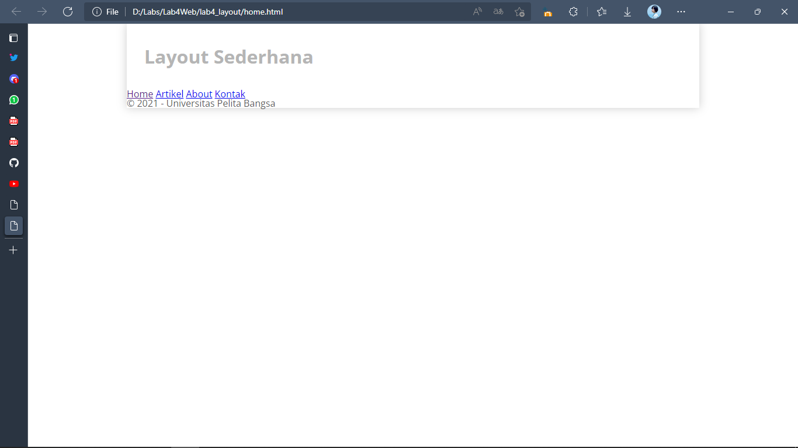 
Setelah membuat dokumen HTML nya kemudian membuat CSS nya dengan menggunakan CSS Eksternal untuk menambahkan gaya dan mengatur ***layout*** nya seperti hasil di atas sudah dengan import font google berikut hasil gambar di atas!

**code html**
```css
/* import google font */
@import
url('https://fonts.googleapis.com/css2?family=Open+Sans:ital,wght@0,300;0,400;0,600;0,700;0,800;1,300;1,400;1,600;1,700;1,800&display=swap');
@import
url('https://fonts.googleapis.com/css2?family=Open+Sans+Condensed:ital,wght@0,300;0,700;1,300&display=swap');
/* Reset CSS */
*{
    margin: 0;
    padding: 0;
}
body{
    line-height: 1;
    font-size: 100%;
    font-family: 'Open Sans',sans-serif;
    color: #5a5a5a;
}
#container{
    width: 980px;
    margin: 0 auto;
    box-shadow: 0 0 1em #cccccc;
}
/* header */
header{
    padding: 20px;
}
header h1{
    margin: 20px 10px;
    color: #b5b5b5;
}
```

## 6).MEMBUAT NAVIGASI
## Output
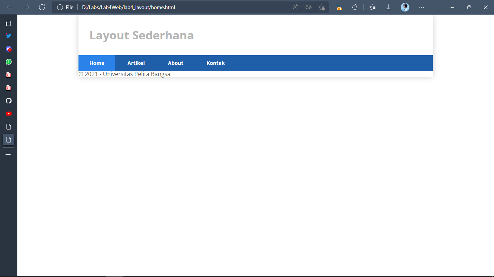
Disini ditambahkan CSS pada bagian ***navigasi*** nya seperti contoh gambar di atas.

**code css**
```css
/* navigasi */
nav{
    display: block;
    background-color: #1f5faa;
}
nav a{
    padding: 15px 30px;
    display: inline-block;
    color: #ffffff;
    font-size: 14px;
    text-decoration: none;
    font-weight: bold;
}
nav a.active,
nav a:hover{
    background-color: #2b83ea;
}
```

## 7).MEMBUAT HERO PANEL
## Output
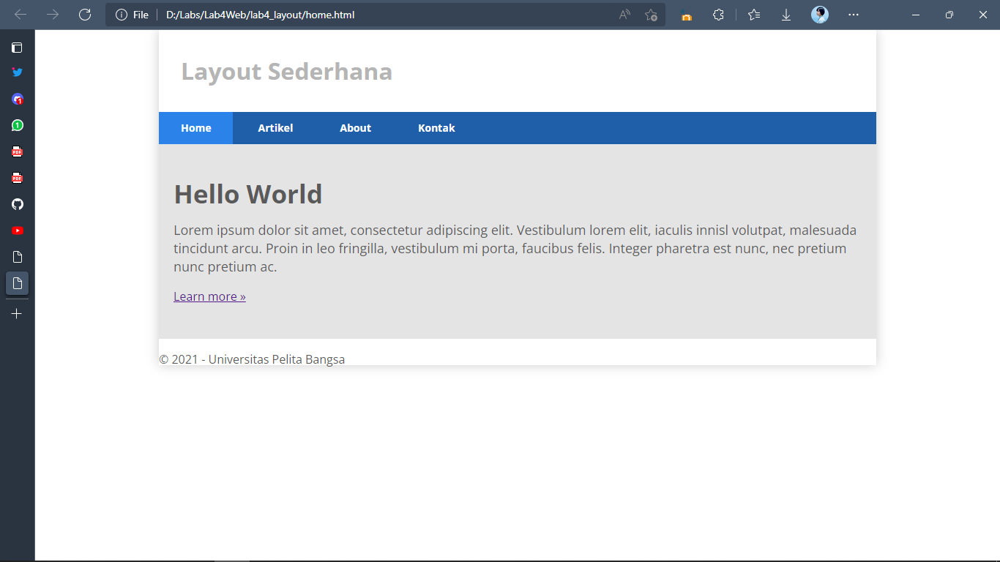
Membuat **ID HERO** untuk kemudian ditambahkan beberapa element **html** dan juga **css** seperti contoh gambar di atas!

**code html**
```html
<section id="hero">
            <h1>Hello World</h1>
            <p>Lorem ipsum dolor sit amet, consectetur adipiscing elit. Vestibulum lorem
                elit, iaculis innisl volutpat, malesuada tincidunt arcu. Proin in leo fringilla,
                vestibulum mi porta, faucibus felis. Integer pharetra est nunc, nec pretium nunc
                pretium ac.</p>
            <a href="home.html" class="btn btn-large">Learn more »</a>
</section>
```

**code css**
```css
/* Hero Panel */
#hero{
    background-color: #e4e4e5;
    padding: 50px 20px;
    margin-bottom: 20px;
}
#hero h1{
    margin-bottom: 20px;
    font-size: 35px;
}
#hero p{
    margin-bottom: 20px;
    font-size: 18px;
    line-height: 25px;
}
```

## 8). MENGATUR LAYOUT MAIN DAN SIDEBAR

Code dibawah adalah bagaimana mengatur main dan sidebar dalam bentuk css

**code css**
```css
/* main content */
#wrapper{
    margin: 0;
}
#main{
    float: left;
    width: 640px;
    padding: 20px;
}
/* sidebar area */
#sidebar{
    float: left;
    width: 260px;
    padding: 20px;
}
```

## 9). MEMBUAT SIDEBAR WIDGET
## Output
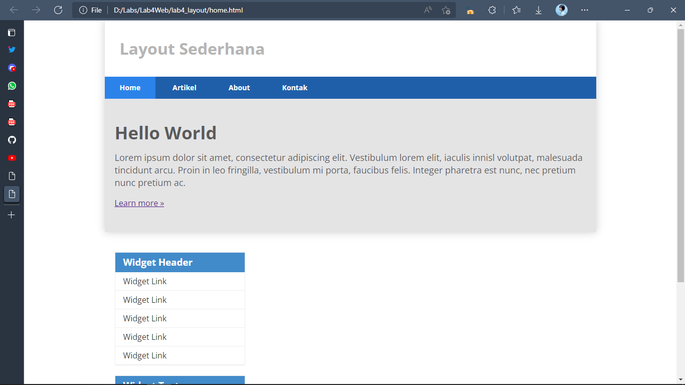
Disini dibuat dengan menggunakan **class widget-box** dalam pendeklarasian di css untuk membuat **sidebar widget** seperti gambar di atas dengan ketentuan **float left**
seperti contoh gambar di atas.

**code html**
```html
            <aside id="sidebar">
                <div class="widget-box">
                    <h3 class="title">Widget Header</h3>
                    <ul>
                        <li><a href="#">Widget Link</a></li>
                        <li><a href="#">Widget Link</a></li>
                        <li><a href="#">Widget Link</a></li>
                        <li><a href="#">Widget Link</a></li>
                        <li><a href="#">Widget Link</a></li>
                    </ul>
                </div>
                <div class="widget-box">
                    <h3 class="title">Widget Text</h3>
                    <p>Vestibulum lorem elit, iaculis in nisl volutpat, malesuada tincidunt
                        arcu. Proin in leo fringilla, vestibulum mi porta, faucibus felis. Integer
                        pharetra est nunc, nec pretium nunc pretium ac.</p>
                </div>
            </aside>
```

**code css**
```css
/* widget */
.widget-box{
    border: 1px solid #eee;
    margin-bottom: 20px;
}
.widget-box .title{
    padding: 10px 16px;
    background-color: #428bca;
    color: #fff;
}
.widget-box ul{
   list-style-type: none;
}
.widget-box li{
    border-bottom: 1px solid #eee;
}
.widget-box li a{
    padding: 10px 16px;
    color: #333;
    display: block;
    text-decoration: none;
}
.widget-box li:hover a{
    background-color: #eee;
}
.widget-box p{
    padding: 15px;
    line-height: 25px;
}
```

## 10). MENGATUR  FOOTER
## Output
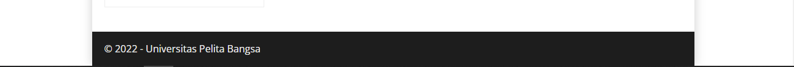
Menambahkan CSS pada bagian **footer** nya seperti contoh gambar di atas.

**code css**
```css
/* footer */
footer{
    clear: both;
    background-color: #1d1d1d;
    padding: 20px;
    color: #eee;
}
```

## 11).MENAMBAHKAN ELEMENT LAINNYA PADA MAIN CONTENT
## Output
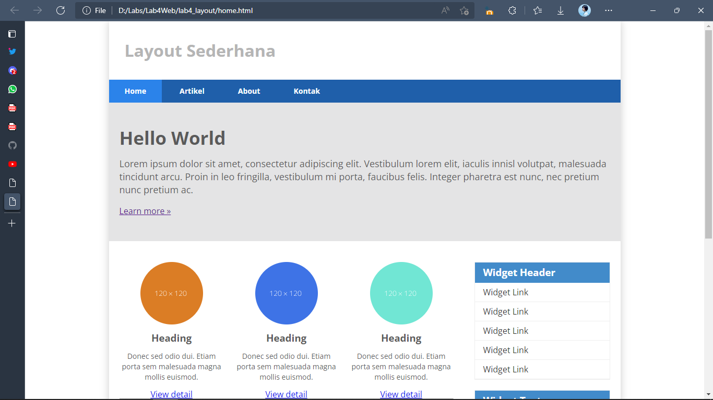
Disini ditambahkan beberapa element HTML dan juga CSS pada bagian **section id main** 

**code html**
```html
<section id="main">
                <div class="row">
                    <div class="box">
                        
                        <h3>Heading</h3>
                        <p>Donec sed odio dui. Etiam porta sem malesuada magna mollis
                            euismod.</p>
                        <a href="#" class="btn btn-default">View detail</a>
                    </div>
                    <div class="box">
                        
                        <h3>Heading</h3>
                        <p>Donec sed odio dui. Etiam porta sem malesuada magna mollis euismod.</p>
                        <a href="#" class="btn btn-default">View detail</a>
                    </div>
                    <div class="box">
                        
                        <h3>Heading</h3>
                        <p>Donec sed odio dui. Etiam porta sem malesuada magna mollis euismod.</p>
                        <a href="#" class="btn btn-default">View detail</a>
                    </div>
                </div>
 </section>
```

**code css**
```css
/* box */
.box{
    display: block;
    float: left;
    width:33.333333%;
    box-sizing: border-box;
    -moz-box-sizing: border-box;
    -webkit-box-sizing:border-box;
    padding: 0 10px;
    text-align: center;
}
.box h3{
    margin: 15px 0;
}
.box p{
    line-height: 20px;
    font-size: 14px;
    margin-bottom: 15px;
}
box img{
    border: 0;
    vertical-align: middle;
}
.image-circle{
    border-radius: 50%;
}
.row{
    margin: 0 -10px;
    box-sizing: border-box;
    -moz-box-sizing: border-box;
    -webkit-box-sizing: border-box;
}
.row::after, .row::before,
.entry::after, .entry::before{
    content: '';
    display: table;
}
.row::after,
.entry::after{
    clear: both;
}
```

## 12). MENAMBAHKAN CONTENT ARTIKEL PADA MAIN CONTENT
## Output
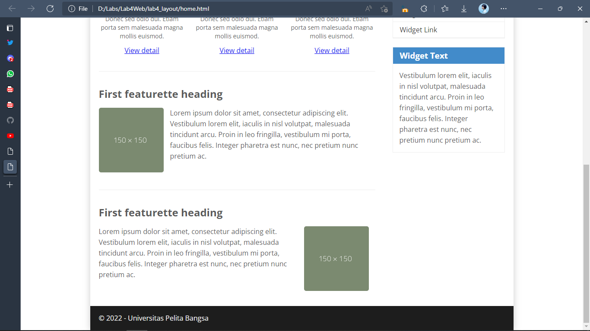
Ditambahkan beberapa element html dalam membuat content artikel dalam **id main** dan juga ditambahkan gaya pada css,seperti gambar di atas adalah contoh nya.

**code html**
```html
                <hr class="divider">
                <article class="entry">
                    <h2>First featurette heading</h2>
                    
                    <p>Lorem ipsum dolor sit amet, consectetur adipiscing elit. Vestibulum lorem
                        elit, iaculis in nisl volutpat, malesuada tincidunt arcu. Proin in leo fringilla,
                        vestibulum mi porta, faucibus felis. Integer pharetra est nunc, nec pretium nunc
                        pretium ac.</p>
                </article>
                <hr class="divider">
                <article class="entry">
                    <h2>First featurette heading</h2>
                    
                    <p>Lorem ipsum dolor sit amet, consectetur adipiscing elit. Vestibulum lorem
                        elit, iaculis in nisl volutpat, malesuada tincidunt arcu. Proin in leo fringilla,
                        vestibulum mi porta, faucibus felis. Integer pharetra est nunc, nec pretium nunc
                        pretium ac.</p>
                </article>
```

**code css**
```css
/*  hr divider  */
.divider{
    border: 0;
    border-top: 1px solid #eeeeee;
    margin: 40px 0;
}
/* entry */
.entry{
    margin: 15px 0;
}
.entry h2{
    margin-bottom: 20px;
}
.entry p{
    line-height: 25px;
}
.entry img{
    float: left;
    border-radius: 5px;
    margin-right: 15px;
}
.entry .right-img{
    float: right;
}
```

------------------------------------------------------------------------------------------------------------------------------------------
## PERTANYAAN DAN TUGAS!

## 1). TAMBAHKAN LAYOUT UNTUK MENU ABOUT

##  => BUAT SINGLE LAYOUT YANG BERISI DESKRIPSI,PORTOFOLIO,DLL
* Buat file HTML baru dengan nama **about.html**, dan buat single layout yang berisi: deskripsi,portofolio,dll

## Output
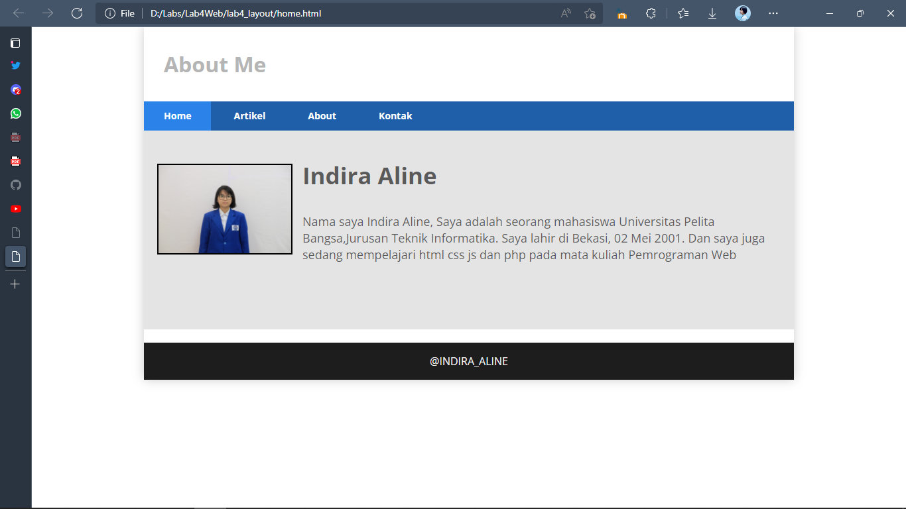

**PENJELASAN**

Gambar di atas adalah contoh dalam membuat **ABOUT** dengan nama fila html nya yaitu ***about.html** dan terhubung langsung melalui link dengan **Home** dan saya juga menggunakan beberap **style.css** eksternal yang tersedia

**code html**
```html
<!DOCTYPE html>
<html lang="en">
<head>
    <meta charset="UTF-8">
    <meta http-equiv="X-UA-Compatible" content="IE=edge">
    <meta name="viewport" content="width=device-width, initial-scale=1.0">
    <title>About Me</title>
    <link rel="stylesheet" href="style.css">
</head>
<body>
    <div id="container">
        <header>
            <h1>About Me</h1>
        </header>
        <nav>
            <a href="home.html" class="active">Home</a>
            <a href="artikel.html">Artikel</a>
            <a href="about.html">About</a>
            <a href="kontak.html">Kontak</a>
        </nav>
        <section id="about">
            <div class="row">
                
                <h1>Indira Aline</h1>
                <p>Nama saya Indira Aline, Saya adalah seorang mahasiswa Universitas Pelita Bangsa,Jurusan Teknik Informatika. Saya lahir di Bekasi, 02 Mei 2001. dan saya juga sedang mempelajari html css js dan php pada mata kuliah Pemrograman Web</p>
            </div>
        </section>
        <footer>
            <p style="text-align: center;">@INDIRA_ALINE</p>
        </footer>
    </div>
</body>
</html>
```
**code css**
```css
/* About Panel */
#about{
    background-color: #e4e4e5;
    padding: 50px 20px;
    margin-bottom: 20px;
}
#about h1{
    margin-bottom: 10px;
    font-size: 35px;
    position: relative;
    left: 15px;
}
#about p{
    margin-bottom: 20px;
    font-size: 18px;
    padding: 30px;
    line-height: 25px;
    position: relative;
    left: 15px;
```

## 2). TAMBAHKAN LAYOUT YANG BERISI UNTUK MENU CONTACT

##  => YANG BERISI FORM ISIAN: NAMA,EMAIL,MESSAGE,DLL
* Buat file HTML baru dengan nama **kontak.html** dan buat form yang berisi: nama,email,message,dll.
## Output
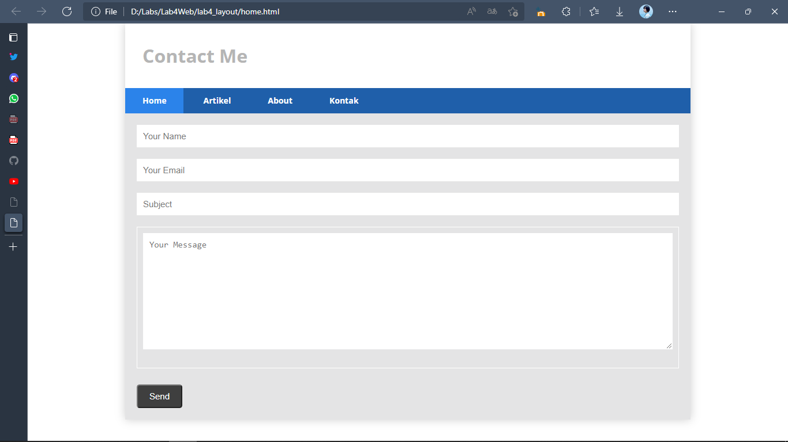
**PENJELASAN**
Disini saya membuat contact dengan beberapa file html dan sedikit menggunakan css eksternal,seperti contoh gambar di atas.

**code html**
```html
<!DOCTYPE html>
<html lang="en">
<head>
    <meta charset="UTF-8">
    <meta http-equiv="X-UA-Compatible" content="IE=edge">
    <meta name="viewport" content="width=device-width, initial-scale=1.0">
    <title>Contact</title>
    <link rel="stylesheet" href="style.css">
</head>
<body>
    <div id="container">
        <header>
            <h1>Contact Me</h1>
        </header>
        <nav>
            <a href="home.html" class="active">Home</a>
            <a href="artikel.html">Artikel</a>
            <a href="about.html">About</a>
            <a href="kontak.html">Kontak</a>
        </nav>
        <section id="kontak">
            <div class="login">
               <input type="text" placeholder="Your Name" class="input">
               <input type="text" placeholder="Your Email" class="input">
            </div>
            <div class="subject">
                <input type="text" placeholder="Subject" class="input"> 
            </div>
            <div class="msg">
                <textarea name="Message" id="Message" cols="35" rows="10" class="area" class="input" placeholder="Your Message"></textarea>
            </div>
            <button type="submit">Send</button>
        </section>
    </div>
</body>
</html>
```

**code css**
```css
/* Kontak Panel */
#kontak{
    background-color: #e4e4e5;
    padding: 20px 20px;
    margin-bottom: 20px;
}
.input,
.msg, .area{
    width: 100%;
    padding: 10px;
    border: 1px solid white;
    box-sizing: border-box;
    font-size: 15px;
    margin-bottom: 20px;
    
}
button{
    font-size: 15px;
    background-color: #3f3f3f;
    color: white;
    border-radius: 5px;
    padding: 10px 20px;
    margin-top: 8px;
}
button:hover{
    opacity: 0,9;
    background-color: #1f5faa;
}
```


## **TERIMA KASIH**
